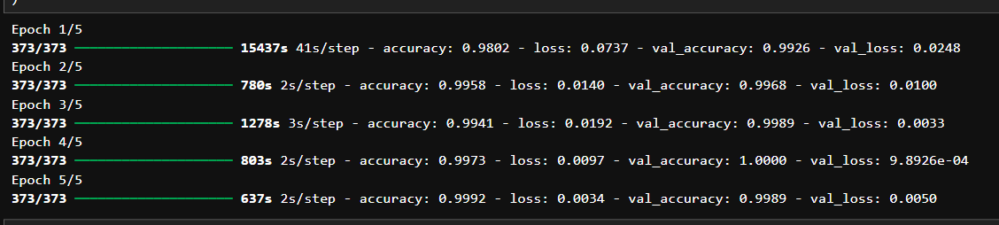
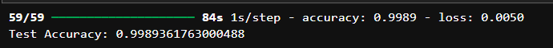

# Image Classification using Transfer Learning (ResNet50)

## Project Summary

This project implements a **deep learning–based multi-class image classification system** using **Transfer Learning with the ResNet50 architecture**. The model is trained to classify images into **eight categories**: airplane, car, cat, dog, flower, fruit, motorbike, and person.

By utilizing a **pre-trained ResNet50 model trained on the ImageNet dataset**, the system leverages existing learned features such as shapes, textures, and patterns. This significantly improves model performance and reduces training time compared to training a neural network from scratch.

The final model achieved a **test accuracy of 99.89%**, demonstrating the effectiveness of transfer learning for image classification tasks.

---

# Project Description

Image classification is a fundamental task in **computer vision**, where a machine learning model automatically assigns labels to images based on their content.

In this project:

* A **deep convolutional neural network (CNN)** architecture is used.
* The **ResNet50 pretrained model** acts as a feature extractor.
* Custom classification layers are added on top of the pretrained network.
* The model is trained and evaluated using a labeled dataset containing eight object categories.

The system can also **predict the class of new images**, making it suitable for real-world applications such as automated image tagging and object recognition systems.

---

# Dataset Information

The dataset contains images categorized into **8 classes**:

| Class     | Description                |
| --------- | -------------------------- |
| Airplane  | Images of aircraft         |
| Car       | Various car images         |
| Cat       | Images of cats             |
| Dog       | Images of dogs             |
| Flower    | Different types of flowers |
| Fruit     | Various fruits             |
| Motorbike | Motorcycle images          |
| Person    | Human images               |

### Dataset Statistics

Training Images: **5959**
Testing Images: **940**
Total Classes: **8**
Image Size: **224 × 224**

Dataset Structure:

```
dataset
│
├── _train
│   ├── airplane
│   ├── car
│   ├── cat
│   ├── dog
│   ├── flower
│   ├── fruit
│   ├── motorbike
│   └── person
│
└── _test
    ├── airplane
    ├── car
    ├── cat
    ├── dog
    ├── flower
    ├── fruit
    ├── motorbike
    └── person
```

---

# Technologies Used

Programming Language
Python

Libraries
TensorFlow
Keras
NumPy
Matplotlib

Deep Learning Model
ResNet50 (Pretrained on ImageNet)

---

# Model Architecture

The model uses **Transfer Learning with ResNet50**.

Architecture:

```
Input Image (224x224x3)
        │
Pretrained ResNet50 (Feature Extraction)
        │
Global Average Pooling Layer
        │
Dense Layer (128 neurons, ReLU)
        │
Dropout Layer (0.5)
        │
Softmax Output Layer (8 Classes)
```

This structure allows the model to use **pretrained visual features** while learning a **new classification task**.

---

# Project Workflow

The project follows these major steps:

1. Import required libraries
2. Load dataset from directories
3. Preprocess images
4. Load pretrained ResNet50 model
5. Freeze base model layers
6. Add custom classification layers
7. Compile the model
8. Train the model
9. Evaluate model performance
10. Predict new images

---

# Code Explanation (Step-by-Step)

## 1. Import Libraries

The required libraries for deep learning, image processing, and visualization are imported.

```python
import tensorflow as tf
from tensorflow.keras import layers, models
from tensorflow.keras.applications import ResNet50
from tensorflow.keras.applications.resnet50 import preprocess_input
import matplotlib.pyplot as plt
import os
```

TensorFlow and Keras are used for building and training the deep learning model.

---

# 2. Define Image Parameters

```python
IMG_SIZE = 224
BATCH_SIZE = 16
```

Images are resized to **224×224** because this is the required input size for ResNet50.

---

# 3. Load Dataset

```python
train_dataset = tf.keras.utils.image_dataset_from_directory(
    train_dir,
    image_size=(IMG_SIZE, IMG_SIZE),
    batch_size=BATCH_SIZE
)
```

This function automatically:

* Loads images
* Resizes them
* Assigns labels based on folder names

---

# 4. Data Preprocessing

ResNet50 requires a specific input preprocessing.

```python
train_dataset = train_dataset.map(lambda x, y: (preprocess_input(x), y))
```

This function:

* Normalizes image pixel values
* Adjusts them to match ImageNet training format

---

# 5. Load Pretrained ResNet50

```python
base_model = ResNet50(
    weights="imagenet",
    include_top=False,
    input_shape=(224,224,3)
)
```

Parameters explained:

weights="imagenet" → loads pretrained weights
include_top=False → removes original classification layer

---

# 6. Freeze Base Model

```python
base_model.trainable = False
```

Freezing prevents pretrained layers from updating during training, allowing the model to retain learned features.

---

# 7. Build the Classification Model

```python
model = models.Sequential([
    base_model,
    layers.GlobalAveragePooling2D(),
    layers.Dense(128, activation='relu'),
    layers.Dropout(0.5),
    layers.Dense(num_classes, activation='softmax')
])
```

Custom layers are added to adapt the model to the new dataset.

---

# 8. Compile the Model

```python
model.compile(
    optimizer='adam',
    loss='sparse_categorical_crossentropy',
    metrics=['accuracy']
)
```

Optimizer: Adam
Loss Function: Sparse Categorical Crossentropy

---

# 9. Train the Model

```python
history = model.fit(
    train_dataset,
    validation_data=test_dataset,
    epochs=5
)
```

The model is trained for **5 epochs** using both training and validation datasets.


 
---

# 10. Evaluate the Model

```python
test_loss, test_acc = model.evaluate(test_dataset)
```

Final Test Accuracy:

**99.89%**
---

 

# 11. Predict Images

## Predict Entire Test Dataset

```python
predictions = model.predict(test_dataset)
predicted_classes = np.argmax(predictions, axis=1)
```

---

## Predict a Single Image

```python
img = image.load_img(img_path, target_size=(224,224))
```

The image is:

1. Loaded
2. Resized
3. Converted to array
4. Preprocessed
5. Sent to the trained model

Example result:

```
Predicted Class: person
```
 


# Visualization

```python
plt.imshow(image.load_img(img_path))
plt.title(f"Predicted: {predicted_class}")
plt.axis("off")
plt.show()
```

This displays the image with the predicted label.

---

# Results

| Metric              | Value      |
| ------------------- | ---------- |
| Training Accuracy   | 99.92%     |
| Validation Accuracy | 99.89%     |
| Test Accuracy       | **99.89%** |

The model performs extremely well due to **transfer learning and powerful CNN features**.

---


---

# Conclusion

This project demonstrates how **transfer learning with ResNet50** can be used to build a highly accurate image classification system with minimal training time.

By leveraging pretrained knowledge from the **ImageNet dataset**, the model achieves **99.89% accuracy**, proving the effectiveness of deep convolutional neural networks for computer vision tasks.

---
